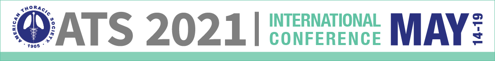
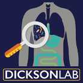
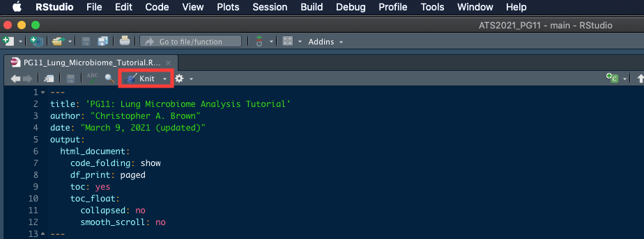

```{r setup, include=FALSE}
knitr::opts_chunk$set(echo = TRUE)
```

<center>





</center>

# ATS 2021 PG11: A HANDS-ON INTRODUCTION TO STUDYING THE LUNG MICROBIOME
This is a guide for acquiring the materials for **ATS 2021 PG11: A HANDS-ON INTRODUCTION TO STUDYING THE LUNG MICROBIOME** which is based on the **Dickson Lab SOP for Analysis of 16S rRNA Gene Amplicon Data**. This repository includes data and source code for a tutorial analysis of the lung microbiome.  

# Preparation & Setup
Prior to starting, several pieces of software need to be acquired. Completing these first three steps is necessary in order to be able to begin working with the code. It should take between 15-30 minutes to complete these preparatory tasks.  

## I. R
First you'll need to acquire R itself. This can be done directly from [CRAN](https://cran.r-project.org/). If R is already installed, we recommend updating to the current version. You can check your R version with `getRversion()`.  

## II. RStudio
Secondly, install the free desktop version of [RStudio](https://rstudio.com/products/rstudio/download/#download). We also recommend updating RStudio if a prior installation exists.  

## III. 16S Analysis SOP Materials
Next, the materials need to be acquired and loaded. First, locate the green **Clone or download** button at the top right of this page, then download the ZIP contents. From your Downloads folder, extract the files from **ATS2021_PG11-master.zip**. We recommend moving this unzipped/extracted directory either to your desktop or preferred workspace. You will need to navigate to this extracted directory in the next step.  

Next, launch RStudio. Then create a new project, by clicking **File > New Project**, in the upper left of the RStudio interface. Click on **Existing Directory** and then browse to find the **ATS2021_PG11-master** directory that was extracted. Finally, left click the file entitled **PG11_Lung_Microbiome_Tutorial.Rmd** from the lower right pane in the RStudio interface.  

This extracted directory includes all of the data and code needed for completing this walkthrough, though the only file you'll need to directly interact with is **PG11_Lung_Microbiome_Tutorial.Rmd**. You can explore at your own pace, either by reviewing the code and running it chunk by chunk, or by creating the report for a more guided experience (see Step V. below).  

## IV. Introduction to R (optional: 90-120 minutes)  
It would also be highly beneficial to be familiar with the basics of R programming prior beginning, though it is not required. A great resource is [R for Data Science](https://r4ds.had.co.nz/). Reading chapters 1 through 5 will familiarize you with the R design philosophy and syntax you'll see during the hands-on presentation.  

## V. Knit the Tutorial (optional: < 5 minutes)  
Finally, the .Rmd file included with these materials can be assembled into an HTML report by clicking the Knit button inside RStudio.  


